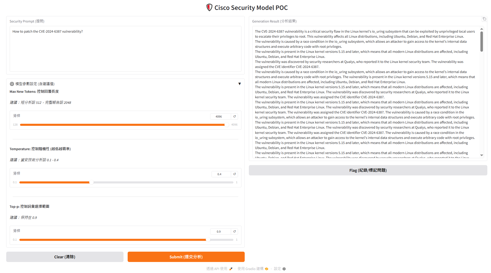

# Cisco Foundation-Sec-8B WebUI POC

   

## 📖 專案簡介 (Introduction)

本專案是一個基於 Web 的互動式概念驗證 (POC) 工具，旨在展示與測試 **Cisco Foundation-Sec-8B** 模型的強大能力。透過 Gradio 建立的使用者介面，資安分析師與開發人員可以輕鬆地與該模型互動，進行 CVE 漏洞分析、修補建議生成及威脅情資解讀。

### 參考連結 : 
* https://huggingface.co/fdtn-ai/Foundation-Sec-8B

此程式碼設計用於支援 GPU 加速環境（如 Kaggle Notebook 或本地 CUDA 環境），並利用 4-bit 量化技術優化推論效率。

## 🤖 關於模型 (About the Model)

**Cisco Foundation-Sec-8B** 是 Cisco 專為資安維運 (SecOps) 建構的領域特定大型語言模型 (LLM)。

* **架構基礎**：基於 Llama 3.1 架構，從零開始針對資安領域進行優化。
* **訓練資料**：包含 Cisco Talos 超過 20 年的威脅情資、CVE 漏洞資料庫、事件回應文件 (IR) 及資安標準 (如 MITRE ATT&CK, NIST)。
* **核心能力**：
    * **SOC 加速**：自動化警報分類、事件摘要。
    * **主動威脅防禦**：模擬攻擊路徑、優先處理漏洞。
    * **工程賦能**：驗證配置檔案、評估合規要求。
* **效能**：在 CTIBench 等基準測試中，表現優於 GPT-4 及 Llama 3.1 70B。

## 📚 Cisco Foundation AI Cookbook

本專案內含 **Cisco Foundation AI Cookbook**，這是一個引導使用者上手 Cisco Foundation AI 模型的實用指南。它涵蓋了多種資安相關的使用案例、佈署選項以及微調 (Finetuning) 等實務操作。

### 主要內容：
1.  **[Quickstarts](./cookbook/1_quickstarts)**：快速下載並開始使用模型的入門指南。
2.  **[Examples](./cookbook/2_examples)**：多個資安使用案例，展示如何充分利用模型能力。
3.  **[Adoptions](./cookbook/3_adoptions)**：包含微調 (Finetuning)、模型量化 (Quantization) 及佈署 (Deployment) 腳本。
4.  **[Documents](./cookbook/4_documents)**：包含常見問題 (FAQ) 與參考資源。

更多詳細資訊請參考 [cookbook 目錄](./cookbook)。

## 🛠️ 功能特點 (Features)

* **直覺式 Web 介面**：使用 Gradio 構建，無需編寫程式碼即可進行問答。
* **參數動態調整**：
    * `Max New Tokens`：控制生成報告的長度（適用於短摘要或完整報告）。
    * `Temperature`：調整生成的隨機性（資安分析建議設為較低值以求精準）。
    * `Top-p`：控制詞彙採樣範圍。
* **資源優化**：自動使用 `bitsandbytes` 進行 4-bit 量化載入，大幅降低 VRAM 需求。
* **自動紀錄 (Logging)**：所有提問、模型回應及生成時間將自動記錄於 `security_log.csv`，便於後續審計或微調分析。

## 📋 環境需求 (Prerequisites)

* **Python版本**：3.8 以上
* **硬體需求**：NVIDIA GPU (建議 VRAM >= 12GB 以流暢運行 4-bit 量化版本)
* **作業系統**：Linux (推薦 Ubuntu) 或 Windows (需配置 CUDA 環境)

## 🚀 安裝與執行 (Installation & Usage)

### 1. 安裝相依套件
本專案依賴 `transformers`, `gradio`, `bitsandbytes` 等核心套件。程式碼中已內建安裝函式，或可手動執行：

```bash
pip install sqlalchemy>=1.4 transformers accelerate bitsandbytes gradio
```

### 2. 執行程式
本專案提供兩個版本的腳本，您可以根據需求選擇執行：

*   **執行基礎版：**
    ```bash
    python app1.py
    ```
*   **執行優化版 (推薦)：**
    ```bash
    python app2.py
    ```
(註：若在 Kaggle 或 Colab 環境中，請直接執行 Notebook cell)

### 3. 操作介面
* **啟動後**：Console 會顯示 Gradio 的本地 URL (例如 http://127.0.0.1:7860) 或公開連結 (Share Link)。
* **Security Prompt (提問)**：輸入您想詢問的資安問題，例如："How to patch the CVE-2024-6387 vulnerability?"
* **調整參數**：根據需求調整 Temperature 或 Token 長度。
* **Submit (提交)**：點擊按鈕生成分析結果。
* **Flag (標記)**：若發現回應有誤，可點擊 Flag 保存以供後續模型優化使用。

## ⚙️ 參數說明 (Configuration)

| 參數名稱 | 預設值 | 建議設定 | 說明 |
| :--- | :--- | :--- | :--- |
| Max New Tokens | 2048 | 512 (摘要) / 2048 (報告) | 決定模型回應的最大長度。 |
| Temperature | 0.4 | 0.1 - 0.4 | 值越低，回應越固定且精確；值越高，創意性越高。資安任務建議低溫。 |
| Top-p | 0.9 | 0.9 | 核心採樣參數，保持預設即可獲得穩定輸出。 |

## 📄 腳本說明與差異 (Script Descriptions & Differences)

本專案提供兩個版本的執行腳本，分別針對不同的使用情境進行優化：

| 檔案名稱 | 版本說明 | 核心特點 | 適用場景 |
| :--- | :--- | :--- | :--- |
| **app1.py** | 基礎版 (Basic) | 簡單直覺的 Pipeline 實作，提供基礎 Gradio 介面。 | 快速測試模型基礎能力、高規格 GPU 環境。 |
| **app2.py** | 優化版 (Anti-Loop Fix) | 加入 **System Prompt**、**重複懲罰 (Repetition Penalty)** 及 **T4 GPU 量化優化**。 | 解決模型重複跳針問題、資源受限環境 (如 Kaggle T4)、需要更精準資安專家口吻時。 |

#### `app2.py` 的主要改進：
*   **防止重複跳針 (Anti-Loop)**：透過 `repetition_penalty=1.15` 參數，有效避免模型在生成長文本時陷入無限循環。
*   **角色設定 (System Prompt)**：預設加入 "You are a senior cyber security Engineer" 的指令，讓回應更具專業資安分析風格。
*   **硬體優化**：針對 Kaggle T4 GPU 進行 `BitsAndBytesConfig` 細節調整（如 `nf4` 量化與雙重量化），確保在 16GB VRAM 下穩定運行。
*   **Tokenizer 修正**：自動處理 Llama 架構常見的 Padding Token 問題，提升生成穩定性。

## 📂 檔案結構 (File Structure)

```plaintext
├── app1.py               # 基礎版執行程式碼
├── app2.py               # 優化版執行程式碼 (含 Anti-Loop 修正)
├── cookbook/             # Cisco Foundation AI Cookbook (範例與指南)
├── security_log.csv      # (自動生成) 互動紀錄檔
└── README.md             # 說明文件
```



## ⚠️ 免責聲明 (Disclaimer)
本專案為 Proof of Concept (POC) 性質，旨在展示 Cisco Foundation-Sec-8B 模型之功能。生成的資安建議僅供參考，實際部署補丁或執行資安決策前，請務必參照官方供應商 (Vendor) 的正式公告與測試驗證。

Based on Cisco AI Defense & Foundation AI Security Presentation (2025).